# Punto de ventas (POS) Web App

Aplicacion web con Angular y .NET CORE.

Esta aplicación es una solución integral de punto de venta (POS) diseñada para facilitar y optimizar la gestión de un negocio. Con características avanzadas como la capacidad de certificar documentos electrónicos (DTEs), imprimir documentos, entre muchas otras funciones. La aplicación es una herramienta completa para agilizar las operaciones y mejorar la experiencia de los clientes.

- [Punto de ventas (POS) Web App](#punto-de-ventas-pos-web-app)
  - [Caracteristicas](#caracteristicas)
  - [Vista Previa.](#vista-previa)
    - [Idioma de la aplicación.](#idioma-de-la-aplicación)
    - [Tema de la aplicación.](#tema-de-la-aplicación)
    - [Configuración inicial del Origen de Datos](#configuración-inicial-del-origen-de-datos)
    - [Inicio de sesión](#inicio-de-sesión)
    - [Configuracion local.](#configuracion-local)
    - [Pantalla princial (Home)](#pantalla-princial-home)
      - [Menú de aplicaciones](#menú-de-aplicaciones)
    - [Detalles de Usuario](#detalles-de-usuario)
    - [Ajustes](#ajustes)
    - [Configuración de impresora.](#configuración-de-impresora)
    - [Módulo de Facturación.](#módulo-de-facturación)
    - [Historial de documentos.](#historial-de-documentos)
    - [Imprimir documento.](#imprimir-documento)
    - [Documento.](#documento)
      - [Nueva cuenta.](#nueva-cuenta)
      - [Actualizar cuenta.](#actualizar-cuenta)
    - [Detalle del documento.](#detalle-del-documento)
    - [Productos encontrados.](#productos-encontrados)
    - [Formulario de Producto.](#formulario-de-producto)
    - [Cargo abono.](#cargo-abono)
- [Configuraciones del proyecto.](#configuraciones-del-proyecto)
  - [Cómo implementar un nuevo idioma para la aplicación.](#cómo-implementar-un-nuevo-idioma-para-la-aplicación)

## Caracteristicas 

* Idioma de la aplicación.

* Tema de la aplicación (claro y oscuro).

* Configuración inicial del Origen de Datos.

* Inicio de sesión.

* Sesiones permanentes.

* Posibilidad de trabajar con varias empresas y sucursales (estaciones de trabajo).

* Menú de árbol (Módulos de la aplicación).

* Configuración de impresora.

* Módulo de facturación.

* Búsqueda de clientes.

* Creación de nuevos clientes.

* Series para un documento.

* Seleccionar vendedores.

* Búsqueda de productos.

* Tipos de precios en productos.

* Bodegas para productos.

* Cargos y descuentos.

* Formas de pago múltiples.

* Certificación de documentos (DTEs).

* Impresión de documentos.

* Historial de documentos emitidos.

* Autoguardado local de documentos.

## Vista Previa.

### Idioma de la aplicación.

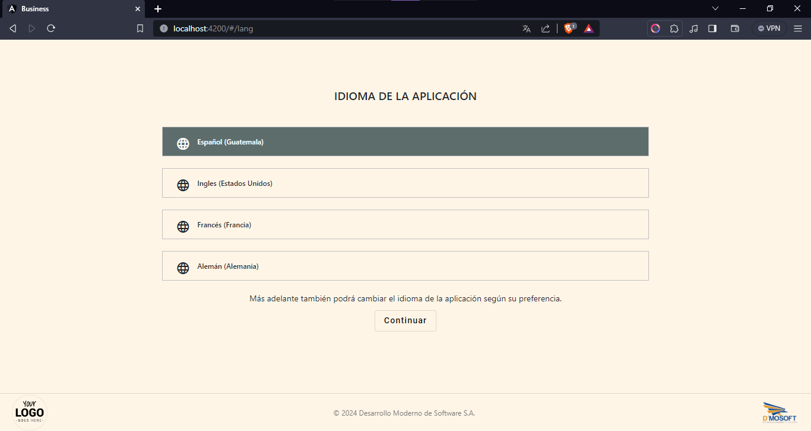

### Tema de la aplicación.

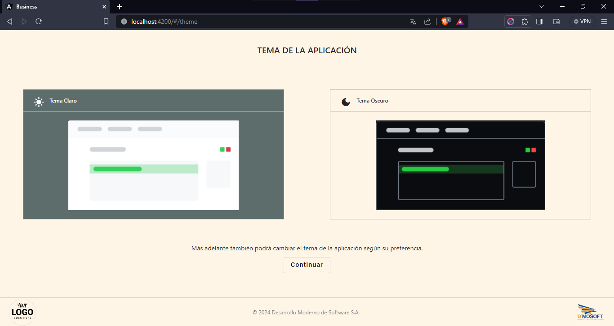

### Configuración inicial del Origen de Datos

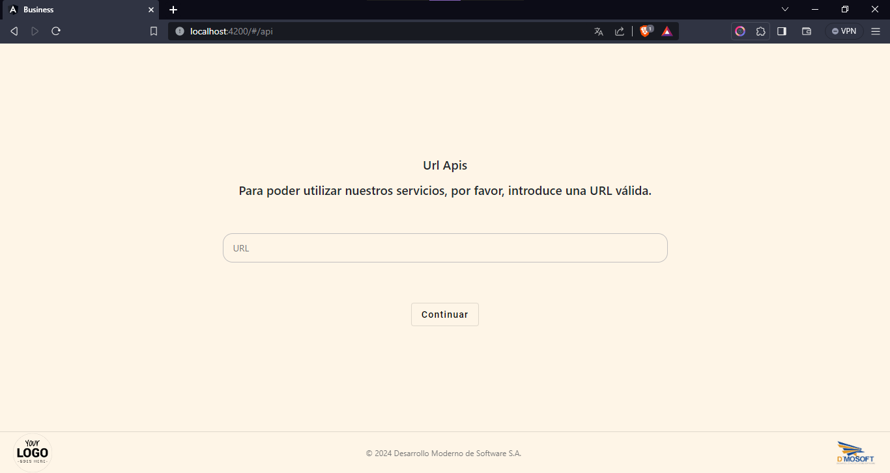

### Inicio de sesión

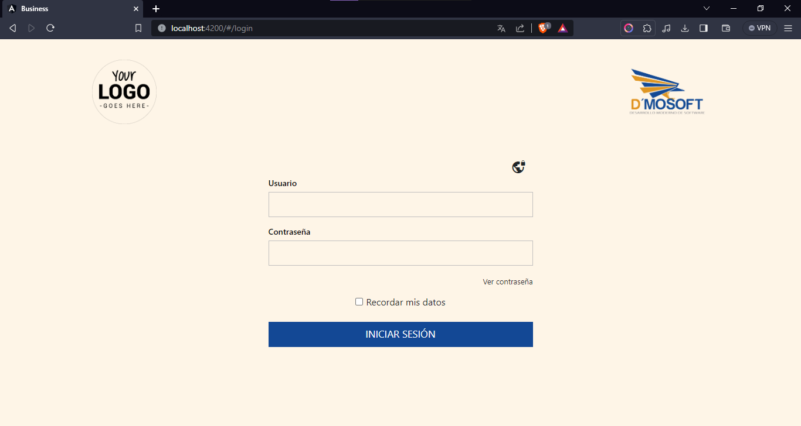

### Configuracion local.

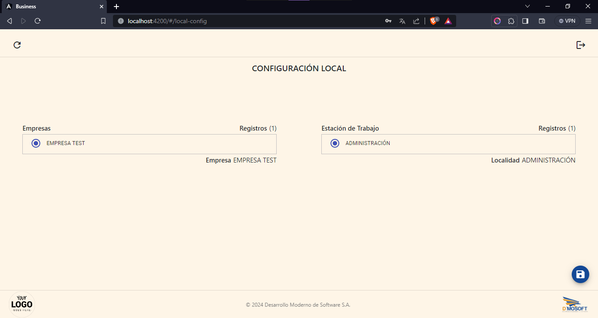

### Pantalla princial (Home)

#### Menú de aplicaciones

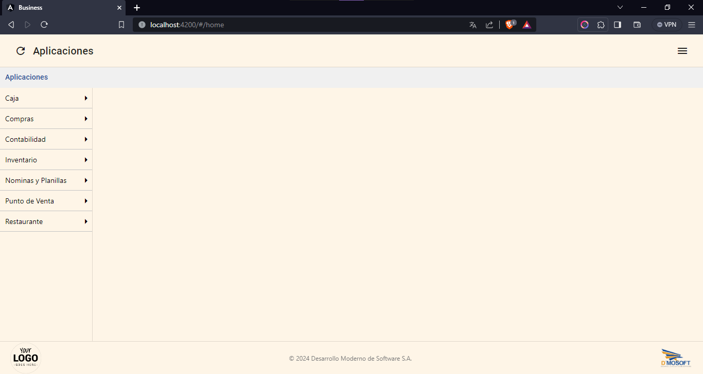

### Detalles de Usuario

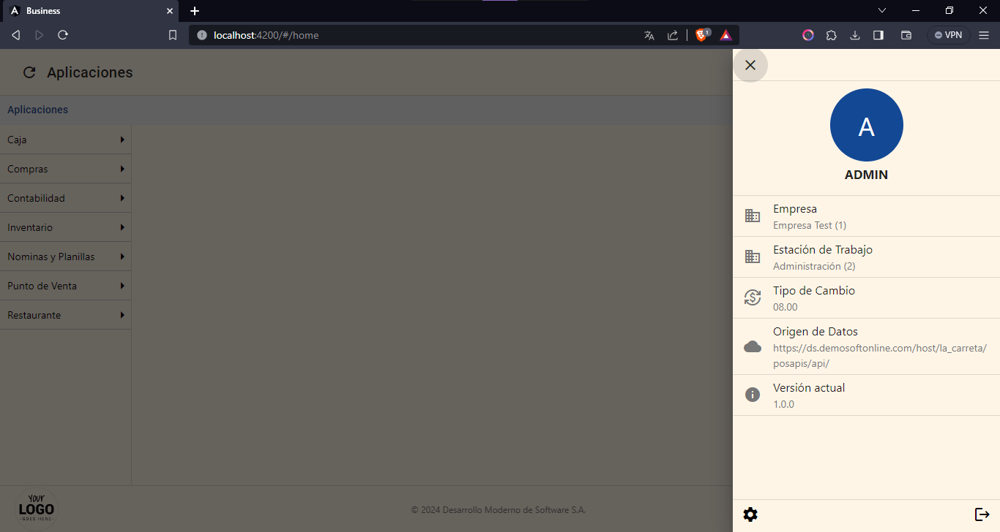

### Ajustes

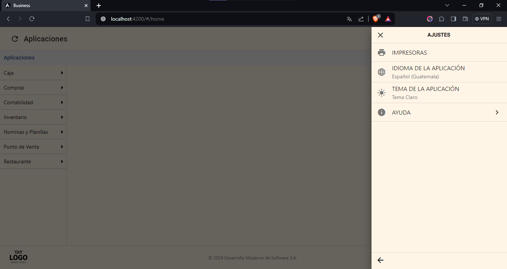

### Configuración de impresora.

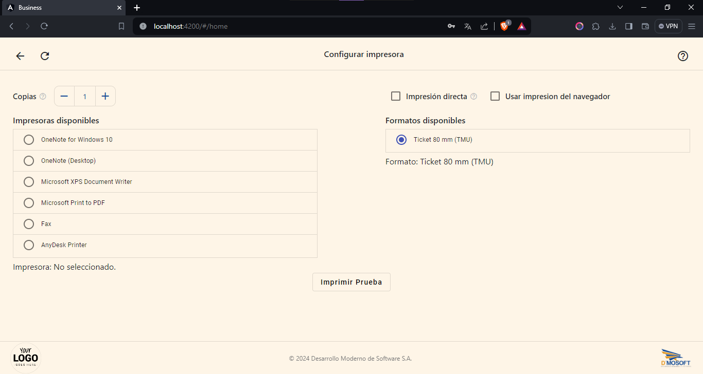

### Módulo de Facturación.

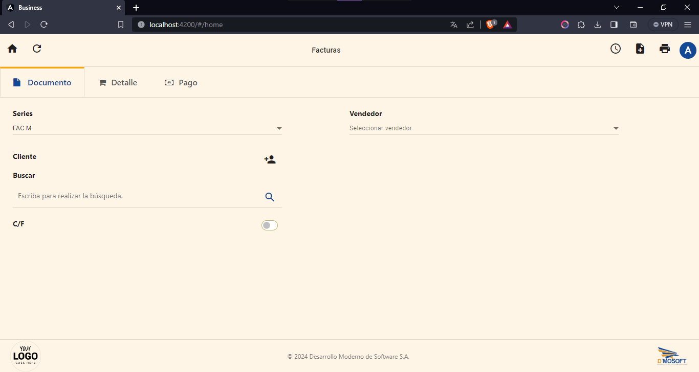

### Historial de documentos.

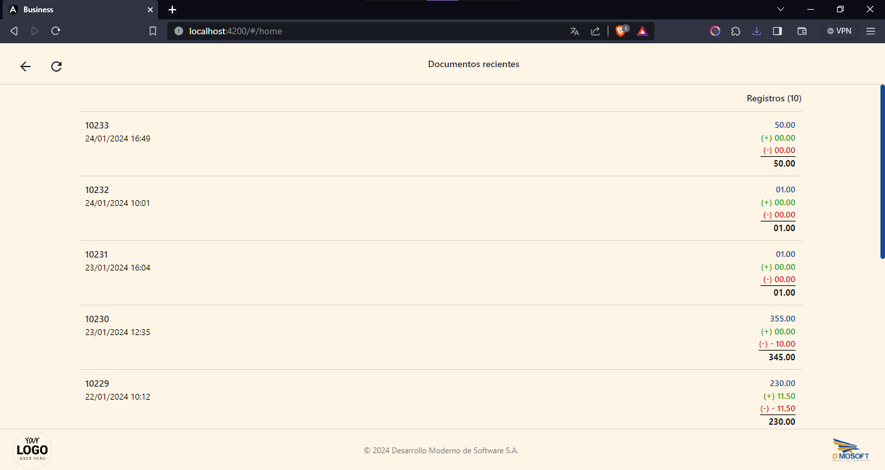

### Imprimir documento.

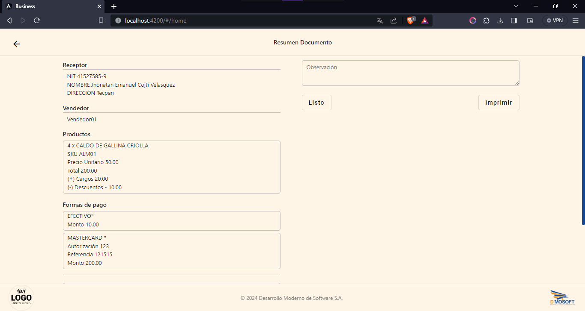

### Documento.


#### Nueva cuenta.

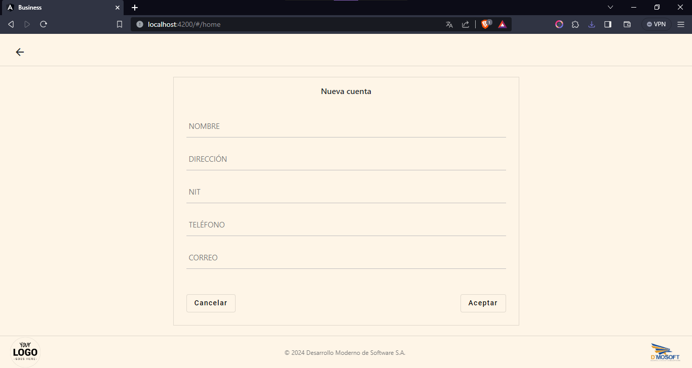

#### Actualizar cuenta.

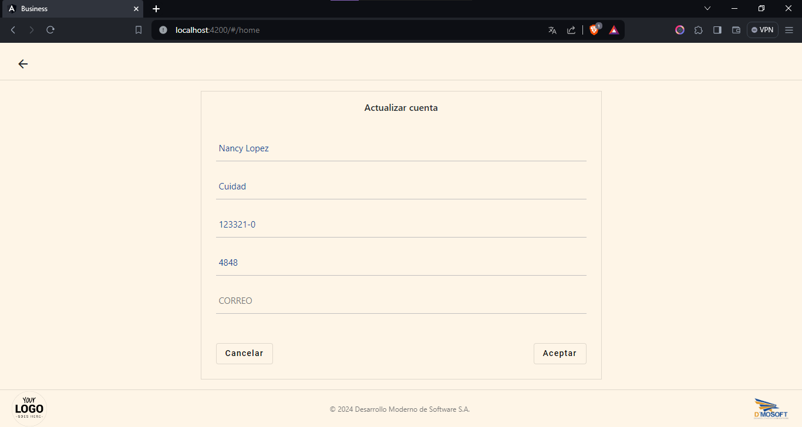

### Detalle del documento.

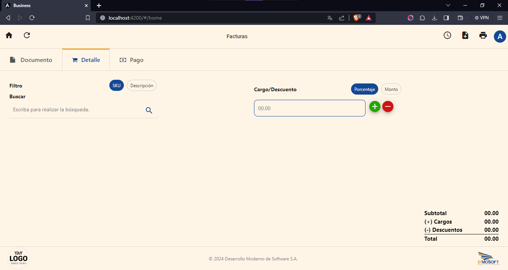

### Productos encontrados.

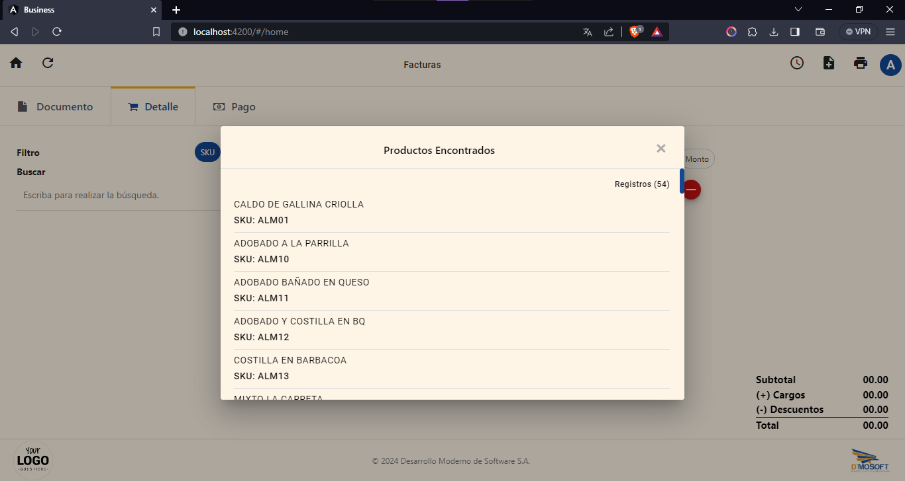

### Formulario de Producto.

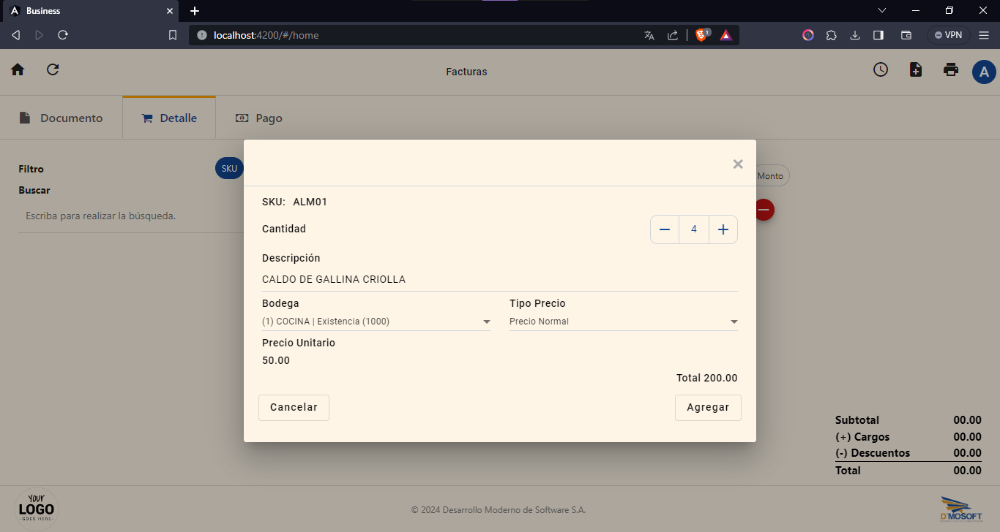

### Cargo abono.

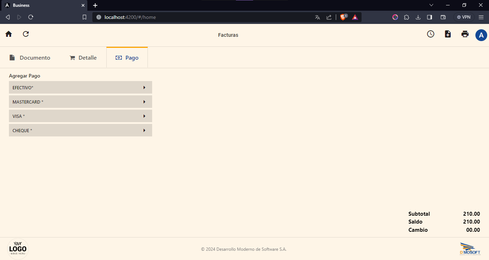

<!-- aquiiiiiiiiiii -->

# Configuraciones del proyecto.

## Cómo implementar un nuevo idioma para la aplicación.

1. En el archivo [languages.provider.ts](src/app/providers/languages.provider.ts) agregar un objeto para el nuevo idioma, usando la interfaz [language.interface.ts](src/app/interfaces/language.interface.ts)

```typescript
export interface LanguageInterface {
    names: Name[];
    lang: string;
    reg: string;
}

export interface Name {
    lrCode: string;
    name: string;
}
```
En donde:

* **names** es una lista de objetos que corresponden a cada idioma elegible por el usuario, las propiedades de cada item de la lista son.

* **lrCode** código que contiene el idioma y región (código de idioma regional (ej: es-ES)).
* **name** nombre el idioma que el usuario visualizara. 

Por lo tanto, cada idioma deberá estar traducida en todos los idiomas disponibles, por ejemplo.

```json
[
  {
    "lrCode": "es-GT",
    "name": "Español (Guatemala)"
  },
  {
    "lrCode": "en-US",
    "name": "Spanish (Guatemala)"
  },
  {
    "lrCode": "fr-FR",
    "name": "Espagnol (Guatemala)"
  }
]
```

**lang** representa el código ISO del idioma.

**reg** representa el código ISO de la región 

Si no sabe el código del idioma que desea agregar [consulte aqui](https://cloud.google.com/translate/docs/languages?hl=es-419)

Si no sabe el código de la región que desea agregar [consulte aquí](https://support.google.com/business/answer/6270107?hl=es)

El archivo objeto completo debería verse de la siguiente manera:

```json
{
    names: [
        {
            lrCode: "es-GT",
            name: "Español (Guatemala)"
        },
        {
            lrCode: "en-US",
            name: "Spanish (Guatemala)"
        },
        {
            lrCode : "fr-FR",
            name : "Espagnol (Guatemala)"
        }
    ],
    lang: "es",
    reg: "GT"
}
```

2. En la carpeta [i18n](src/assets/i18n) ubicada en la carpeta [assets](src/assets) 
 crear un archivo **.json** para el idioma que se quiera agregar, para nombrar los archivos se debe tomar el código ISO del idioma , por ejemplo: **en.json** para el idioma Inglés.

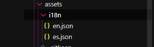

3. El contenido del archivo deberá ser el mismo json que los otros archivos ya existentes, con la diferencia que el valor de las propiedades debe ser la traducción de los textos al idioma que se quiera agregar, tome como base el archivo es.json que corresponde al idioma original del proyecto (Español).

Ejemplo del archivo **es.json** con traucciones en Español

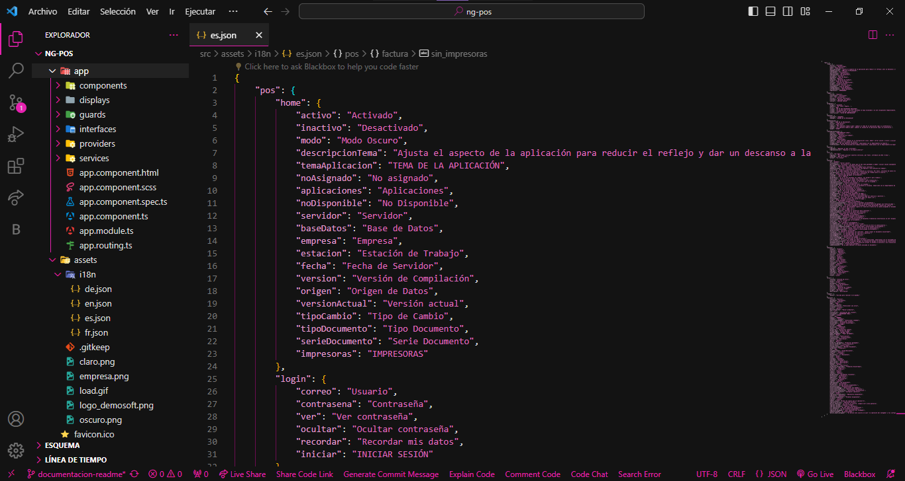

Ejemplo del archivo **en.json** con traucciones en Inglés

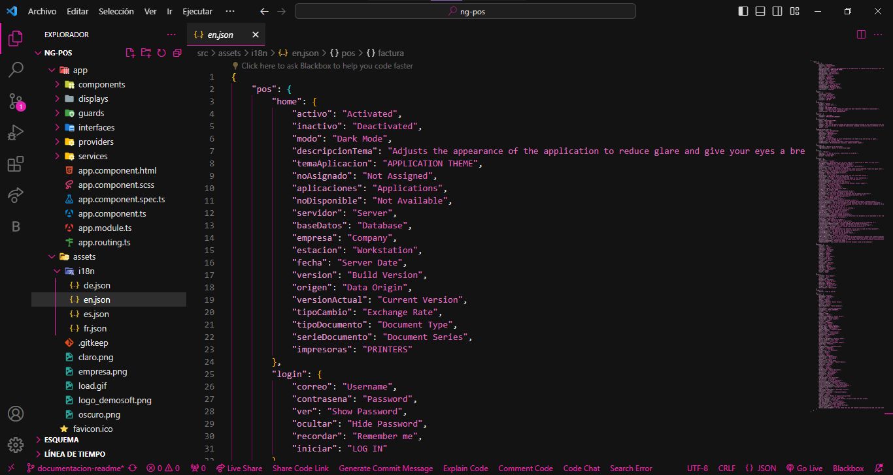